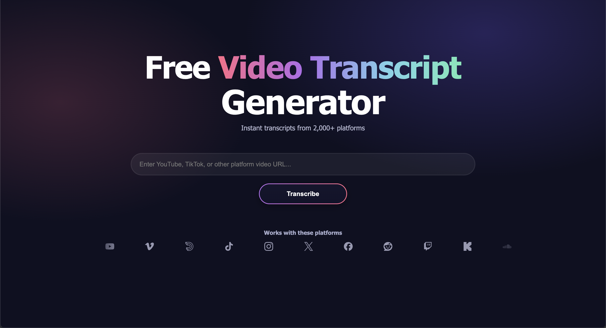

<div align="center">

# AI Video Transcriber

English | [中文](README_ZH.md)

An AI-powered video transcription tool that supports multiple video platforms including YouTube, Tiktok, Bilibili, and 30+ platforms.



</div>

## ✨ Features

- 🎥 **Multi-Platform Support**: Works with YouTube, Tiktok, Bilibili, and 2000+ more
- 🗣️ **Intelligent Transcription**: High-accuracy speech-to-text using Faster-Whisper
- ⚡ **Fast, Local Processing**: End-to-end transcription with Faster-Whisper
- 📱 **Mobile-Friendly**: Perfect support for mobile devices

## 🚀 Quick Start

### Prerequisites

- Python 3.8+
- FFmpeg

### Installation

#### Method 1: Automatic Installation

```bash
# Clone the repository
git clone https://github.com/wendy7756/AI-Video-Transcriber.git
cd AI-Video-Transcriber

# Run installation script
chmod +x install.sh
./install.sh
```

#### Method 2: Docker

```bash
# Clone the repository
git clone https://github.com/wendy7756/AI-Video-Transcriber.git
cd AI-Video-Transcriber

# Using Docker Compose (easiest)
docker-compose up -d

# Or using Docker directly
docker build -t ai-video-transcriber .
docker run -p 8000:8000 ai-video-transcriber
```

#### Method 3: Manual Installation

1. **Install Python Dependencies**
```bash
# macOS (PEP 668) strongly recommends using a virtualenv
python3 -m venv venv
source venv/bin/activate
python -m pip install --upgrade pip
pip install -r requirements.txt
```

2. **Install FFmpeg**
```bash
# macOS
brew install ffmpeg

# Ubuntu/Debian
sudo apt update && sudo apt install ffmpeg

# CentOS/RHEL
sudo yum install ffmpeg
```

3. **Environment**
No external API keys are required for transcription.

### Start the Service

```bash
python3 start.py
```

After the service starts, open your browser and visit `http://localhost:8000`

#### Production Mode (Recommended for long videos)

To avoid SSE disconnections during long processing, start in production mode (hot-reload disabled):

```bash
python3 start.py --prod
```

This keeps the SSE connection stable throughout long tasks (30–60+ min).

### Demo without GCP costs

You can demo the app publicly by running the backend on your laptop and proxying the Netlify site’s `/api/*` to your local API via an HTTPS tunnel.

#### Option A: Local only (everything on your machine)

```bash
# From the inner project folder
cd ~/Desktop/VidTranscript/VidTranscript
source venv/bin/activate
python -m uvicorn backend.main:app --host 127.0.0.1 --port 8000
# Open: http://127.0.0.1:8000
```

#### Option B: Public demo (frontend on Netlify, backend on your laptop)

1. **Start backend locally**
```bash
cd ~/Desktop/VidTranscript/VidTranscript
source venv/bin/activate
python -m uvicorn backend.main:app --host 127.0.0.1 --port 8000
```

2. **Expose your local API via HTTPS tunnel** (choose one)
```bash
# ngrok (install: brew install --cask ngrok; then ngrok config add-authtoken <TOKEN>)
ngrok http http://127.0.0.1:8000
# copy the https URL it prints, e.g. https://<random>.ngrok-free.app

# or Cloudflare Tunnel
brew install cloudflared
cloudflared tunnel --url http://127.0.0.1:8000
# copy the https URL it prints, e.g. https://<random>.trycloudflare.com
```

3. **Point Netlify to your tunnel**

Create/edit `static/_redirects` so the browser calls your site and Netlify proxies to your tunnel:

```
/api/*  https://YOUR_TUNNEL_HOST/api/:splat  200
```

Commit and deploy:

```bash
git add static/_redirects
git commit -m "demo: proxy /api to local tunnel"
git push
```

4. **Open the site**

Visit `https://vidtranscript.com` (or `https://www.vidtranscript.com`). All `/api/*` calls will be proxied to your local backend via the tunnel.

5. **Stop after demo**

- Ctrl+C to stop `uvicorn` and the tunnel.
- Optionally remove the `_redirects` line and redeploy so production no longer proxies to your laptop.

## 📖 Usage Guide

1. **Enter Video URL**: Paste a video link from YouTube, Bilibili, or other supported platforms
2. **Start Processing**: Click the "Transcribe" button
3. **Monitor Progress**: Watch real-time progress through multiple stages:
   - Video download and parsing
   - Audio transcription with Faster-Whisper
4. **View Results**: Review the transcript
5. **Download**: Click to download the Markdown transcript

## 🌐 Supported Platforms (Top 20)

The app uses `yt-dlp` under the hood and supports many sites, including but not limited to the following top 20 platforms: YouTube, Vimeo, Dailymotion, TikTok, Instagram, X (Twitter), Facebook, Reddit, Twitch, Kick, SoundCloud, Bandcamp, Spotify, BiliBili, Douyin, BBC iPlayer, CNN, Coursera, Khan Academy, TED.

Note:
- Some sites may require login, have geo-restrictions, or change unexpectedly.
- Additional sites may work via yt-dlp’s generic extractor.

### Coverage & Categories (via yt-dlp)

yt-dlp supports approximately 2,000 different media platforms and websites. See:
- Official list: https://github.com/yt-dlp/yt-dlp/blob/master/supportedsites.md
- DeepWiki overview: https://deepwiki.com/yt-dlp/yt-dlp

High-level categories (examples):
- **Major Video Platforms**: YouTube (most comprehensive extractor), Vimeo (albums/channels/playlists), Dailymotion, TikTok
- **Social Media**: Instagram (posts/stories/reels), Twitter/X (tweet videos), Facebook, Reddit
- **Streaming & Live**: Twitch (live/VOD), Kick (live)
- **Audio Platforms**: SoundCloud (music/podcasts), Bandcamp (albums/tracks)
- **Asian Platforms**: BiliBili (extensive support), Douyin
- **News & Media**: BBC iPlayer, CNN
- **Educational**: Coursera, Udemy, TED

Important:
- Site support can break when platforms change; try the URL if in doubt.
- Some sources may need authentication or be region‑locked.

## 🛠️ Technical Architecture

### Backend Stack
- **FastAPI**: Modern Python web framework
- **yt-dlp**: Video downloading and processing
- **Faster-Whisper**: Efficient speech transcription

### Frontend Stack
- **HTML5 + CSS3**: Responsive interface design
- **JavaScript (ES6+)**: Modern frontend interactions
- **Marked.js**: Markdown rendering
- **Font Awesome**: Icon library

### Project Structure
```
AI-Video-Transcriber/
├── backend/                 # Backend code
│   ├── main.py             # FastAPI main application
│   ├── video_processor.py  # Video processing module
│   ├── transcriber.py      # Transcription module
├── static/                 # Frontend files
│   ├── index.html          # Main page
│   └── app.js              # Frontend logic
├── temp/                   # Temporary files directory
├── Dockerfile              # Docker image configuration
├── docker-compose.yml      # Docker Compose configuration
├── .dockerignore           # Docker ignore rules
├── .env.example            # Environment variables template
├── requirements.txt        # Python dependencies
├── start.py               # Startup script
└── README.md              # Project documentation
```

## ⚙️ Configuration Options

### Environment Variables

| Variable | Description | Default | Required |
|----------|-------------|---------|----------|
| `HOST` | Server address | `0.0.0.0` | No |
| `PORT` | Server port | `8000` | No |
| `WHISPER_MODEL_SIZE` | Whisper model size | `base` | No |

### Whisper Model Size Options

| Model | Parameters | English-only | Multilingual | Speed | Memory Usage |
|-------|------------|--------------|--------------|-------|--------------|
| tiny | 39 M | ✓ | ✓ | Fast | Low |
| base | 74 M | ✓ | ✓ | Medium | Low |
| small | 244 M | ✓ | ✓ | Medium | Medium |
| medium | 769 M | ✓ | ✓ | Slow | Medium |
| large | 1550 M | ✗ | ✓ | Very Slow | High |

## 🔧 FAQ

### Q: Why is transcription slow?
A: Transcription speed depends on video length, Whisper model size, and hardware performance. Try using smaller models (like tiny or base) to improve speed.

### Q: Which video platforms are supported?
A: All platforms supported by yt-dlp, including but not limited to: YouTube, TikTok, Facebook, Instagram, Twitter, Bilibili, Youku, iQiyi, Tencent Video, etc.

### Q: I get HTTP 500 errors when starting/using the service. Why?
A: In most cases this is an environment configuration issue rather than a code bug. Please check:
- Ensure a virtualenv is activated: `source venv/bin/activate`
- Install deps inside the venv: `pip install -r requirements.txt`
- Install FFmpeg: `brew install ffmpeg` (macOS) / `sudo apt install ffmpeg` (Debian/Ubuntu)
- If port 8000 is occupied, stop the old process or change `PORT`

### Q: How to handle long videos?
A: The system can process videos of any length, but processing time will increase accordingly. For very long videos, consider using smaller Whisper models.

### Q: How to use Docker for deployment?
A: Docker provides the easiest deployment method:

**Prerequisites:**
- Install Docker Desktop from https://www.docker.com/products/docker-desktop/
- Ensure Docker service is running

**Quick Start:**
```bash
# Clone and setup
git clone https://github.com/wendy7756/AI-Video-Transcriber.git
cd AI-Video-Transcriber
# Start with Docker Compose (recommended)
docker-compose up -d

# Or build and run manually
docker build -t ai-video-transcriber .
docker run -p 8000:8000 ai-video-transcriber
```

**Common Docker Issues:**
- **Port conflict**: Change port mapping `-p 8001:8000` if 8000 is occupied
- **Permission denied**: Ensure Docker Desktop is running and you have proper permissions
- **Build fails**: Check disk space (need ~2GB free) and network connection

**Docker Commands:**
```bash
# View running containers
docker ps

# Check container logs
docker logs ai-video-transcriber-ai-video-transcriber-1

# Stop service
docker-compose down

# Rebuild after changes
docker-compose build --no-cache
```

### Q: What are the memory requirements?
A: Memory usage varies depending on the deployment method and workload:

**Docker Deployment:**
- **Base memory**: ~128MB for idle container
- **During processing**: 500MB - 2GB depending on video length and Whisper model
- **Docker image size**: ~1.6GB disk space required
- **Recommended**: 4GB+ RAM for smooth operation

**Traditional Deployment:**
- **Base memory**: ~50-100MB for FastAPI server
- **Whisper models memory usage**:
  - `tiny`: ~150MB
  - `base`: ~250MB  
  - `small`: ~750MB
  - `medium`: ~1.5GB
  - `large`: ~3GB
- **Peak usage**: Base + Model + Video processing (~500MB additional)

**Memory Optimization Tips:**
```bash
# Use smaller Whisper model to reduce memory usage
WHISPER_MODEL_SIZE=tiny  # or base

# For Docker, limit container memory if needed
docker run -m 1g -p 8000:8000 --env-file .env ai-video-transcriber

# Monitor memory usage
docker stats ai-video-transcriber-ai-video-transcriber-1
```

### Q: Network connection errors or timeouts?
A: If you encounter network-related errors during video downloading or API calls, try these solutions:

**Common Network Issues:**
- Video download fails with "Unable to extract" or timeout errors
- OpenAI API calls return connection timeout or DNS resolution failures
- Docker image pull fails or is extremely slow

**Solutions:**
1. **Switch VPN/Proxy**: Try connecting to a different VPN server or switch your proxy settings
2. **Check Network Stability**: Ensure your internet connection is stable
3. **Retry After Network Change**: Wait 30-60 seconds after changing network settings before retrying
4. **Use Alternative Endpoints**: If using custom OpenAI endpoints, verify they're accessible from your network
5. **Docker Network Issues**: Restart Docker Desktop if container networking fails

**Quick Network Test:**
```bash
# Test video platform access
curl -I https://www.youtube.com/

# Test OpenAI API access (replace with your endpoint)
curl -I https://api.openai.com

# Test Docker Hub access
docker pull hello-world
```

## 🎯 Supported Languages

### Transcription
- Supports 100+ languages through Whisper
- Automatic language detection
- High accuracy for major languages

<!-- Summary generation has been removed -->

## 📈 Performance Tips

- **Hardware Requirements**:
  - Minimum: 4GB RAM, dual-core CPU
  - Recommended: 8GB RAM, quad-core CPU
  - Ideal: 16GB RAM, multi-core CPU, SSD storage

- **Processing Time Estimates**:
  | Video Length | Estimated Time | Notes |
  |-------------|----------------|-------|
  | 1 minute | 30s-1 minute | Depends on network and hardware |
  | 5 minutes | 2-5 minutes | Recommended for first-time testing |
  | 15 minutes | 5-15 minutes | Suitable for regular use |

## 🤝 Contributing

We welcome Issues and Pull Requests!

1. Fork the project
2. Create a feature branch (`git checkout -b feature/AmazingFeature`)
3. Commit your changes (`git commit -m 'Add some AmazingFeature'`)
4. Push to the branch (`git push origin feature/AmazingFeature`)
5. Open a Pull Request


## Acknowledgments

- [yt-dlp](https://github.com/yt-dlp/yt-dlp) - Powerful video downloading tool
- [Faster-Whisper](https://github.com/guillaumekln/faster-whisper) - Efficient Whisper implementation
- [FastAPI](https://fastapi.tiangolo.com/) - Modern Python web framework

## 📞 Contact

For questions or suggestions, please submit an Issue or contact Wendy.

## ⭐ Star History

If you find this project helpful, please consider giving it a star!